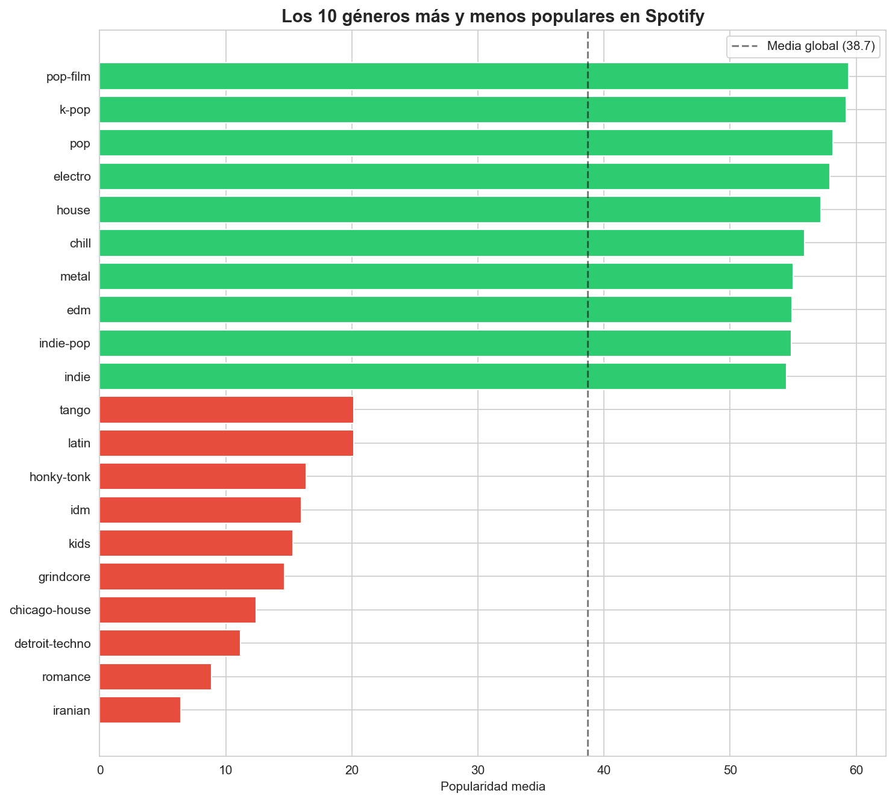
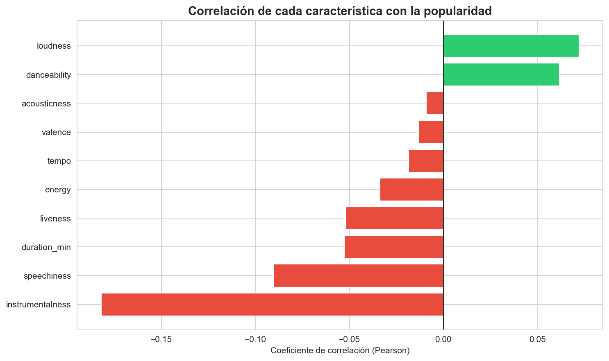
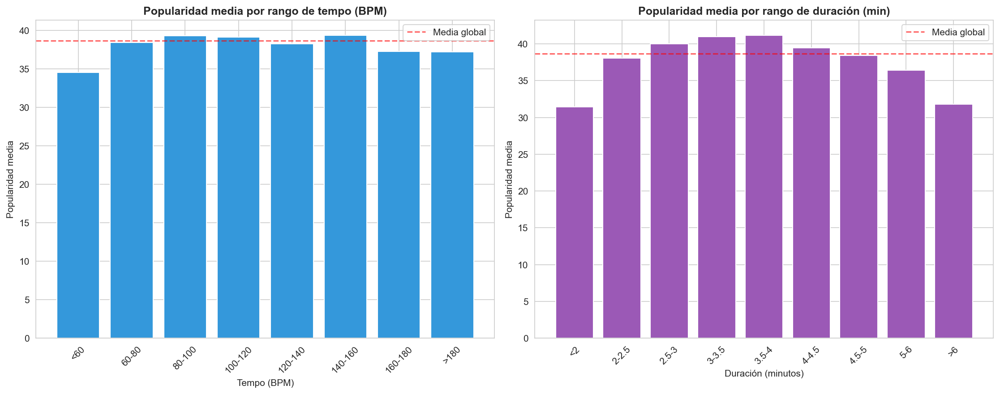
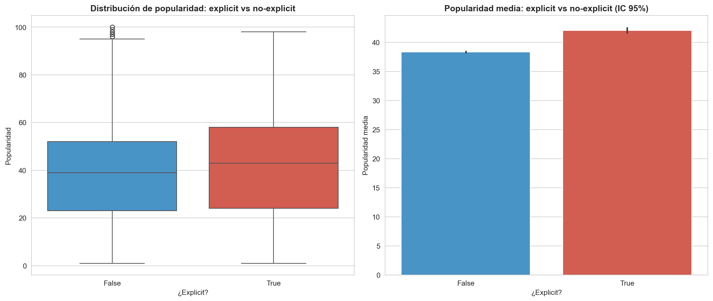

# ¿Qué hace popular a una canción en Spotify?

Análisis exploratorio y estadístico de **97.827 canciones** de Spotify para identificar qué características (género, audio features, duración, contenido explícito) están asociadas a la popularidad de un tema.

**Stack:** Python · pandas · matplotlib · seaborn · scipy · Jupyter Notebook

---

## TL;DR

Las características técnicas de una canción explican **muy poco** de su popularidad — el éxito depende sobre todo de factores ajenos al audio (artista, marketing, viralidad). Sin embargo, hay tres patrones robustos:

1. **Existe una duración óptima** entre 3 y 4 minutos. Canciones fuera de ese rango pierden hasta un 25% de popularidad.
2. **Las canciones con voz son más populares que las instrumentales** (mayor correlación observada: -0,18 para `instrumentalness`).
3. **El contenido explícito se asocia a mayor popularidad**, pero con un tamaño de efecto pequeño (+3,7 puntos sobre 100).

---

## Dataset

- **Fuente:** [Spotify Tracks Dataset](https://www.kaggle.com/datasets/maharshipandya/-spotify-tracks-dataset) (Kaggle, `maharshipandya/-spotify-tracks-dataset`)
- **Licencia:** [Open Data Commons Open Database License (ODbL) v1.0](https://opendatacommons.org/licenses/odbl/1-0/)
- **Tamaño original:** 114.000 canciones × 21 columnas
- **Tamaño final tras limpieza:** 97.827 canciones
- **Estructura:** 114 géneros × 1.000 canciones cada uno (dataset perfectamente balanceado)

> Contains information from the [Spotify Tracks Dataset](https://www.kaggle.com/datasets/maharshipandya/-spotify-tracks-dataset), which is made available under the [Open Database License (ODbL)](https://opendatacommons.org/licenses/odbl/1-0/).

El archivo CSV **no está incluido en este repositorio** (véase `.gitignore`). Para reproducir el análisis, descárgalo desde Kaggle y colócalo en la carpeta `data/`.

### Proceso de limpieza

| Paso                 | Filas eliminadas | Motivo                                              |
|----------------------|------------------|-----------------------------------------------------|
| Nulos                | 3                | Valores faltantes en campos clave                   |
| Duración o tempo = 0 | 158              | Datos corruptos (canciones de 0 segundos o 0 BPM)   |
| Popularity = 0       | 16.020           | Probablemente datos faltantes codificados como cero |

---

## Preguntas de análisis

### 1. ¿Qué géneros dominan en popularidad?

El género más popular es `pop-film` (Bollywood), seguido de `k-pop` y `pop`. En el extremo opuesto aparecen géneros de nicho con audiencias muy restringidas (`iranian`, `romance`, `detroit-techno`).

- Diferencia entre el género #1 y el último: **53 puntos sobre 100**
- Desviación estándar entre géneros: **12,14**



> **Nota:** `latin` aparece en el bottom 20, pero no significa que la música latina sea impopular. Spotify clasifica `latin` como una categoría aparte de `reggaeton`, `salsa` o `latino`, por lo que el dato refleja una convención del dataset, no una conclusión musical.

### 2. ¿Qué características de audio predicen la popularidad?

Se calculó la matriz de correlación (Pearson) entre la popularidad y 10 audio features. **Ninguna correlación supera |0,2|** — el éxito musical no se explica por las características técnicas de la canción.



El predictor individual más robusto es `instrumentalness` (r = -0,18): las canciones **con voz** tienden a ser más populares.

La matriz completa revela, además, multicolinealidades relevantes:
- `energy` ↔ `loudness`: 0,76
- `energy` ↔ `acousticness`: -0,73
- `danceability` ↔ `valence`: 0,46

Estas correlaciones cruzadas deberían tenerse en cuenta en cualquier modelo predictivo (riesgo de multicolinealidad en regresión lineal).

### 3. ¿Existe un tempo y duración "ideales"?

**Tempo:** sin patrón relevante. Las canciones <60 BPM son ligeramente menos populares; el resto oscila entre 37 y 39 puntos.

**Duración:** curva en U invertida muy clara — **el pico de popularidad está entre 3 y 4 minutos**.

| Rango           | Popularidad media |
|-----------------|-------------------|
| < 2 min         | 31,4              |
| 2,5 – 3 min     | 40,0              |
| **3,5 – 4 min** | **41,2 (pico)**   |
| 4 – 4,5 min     | 39,4              |
| > 6 min         | 31,8              |



**Insight metodológico:** la correlación lineal de `duration_min` con `popularity` era prácticamente nula (-0,05), pero el análisis por rangos reveló un patrón no lineal significativo. **Las correlaciones de Pearson pueden ocultar relaciones no lineales.**

### 4. ¿El contenido explícito ayuda o perjudica?

Solo el **8,63%** del catálogo es explicit.

| Categoría   | Popularidad media | Mediana | N      |
|-------------|-------------------|---------|--------|
| Explicit    | 42,09             | 43      | 8.442  |
| No explicit | 38,35             | 39      | 89.385 |

- Diferencia: **+3,74 puntos a favor de explicit**
- Test t de Student: t = 17,11, p < 0,001 → estadísticamente significativa.



> **Interpretación con cautela:** aunque la diferencia es significativa, el tamaño del efecto es pequeño y las distribuciones se solapan ampliamente. Con n = 97.827 cualquier diferencia mínima se vuelve "significativa". **La significación estadística no implica importancia práctica.** Probablemente la mayor popularidad de las canciones explícitas se deba a que este tag está sobrerrepresentado en géneros comerciales dominantes (hip-hop, reggaeton) más que a una preferencia intrínseca del oyente.

---

## Limitaciones

- La variable `popularity` de Spotify es un índice agregado no totalmente documentado por la API.
- Factores clave del éxito musical (marketing, fecha de lanzamiento, virality, fama del artista) **no están en el dataset**, lo que explica las bajas correlaciones observadas.
- La clasificación de géneros es una convención interna de Spotify y puede no reflejar categorías musicales estándar.
- El análisis es observacional y transversal; no se establecen relaciones causales.

---

## Próximos pasos

- Modelo predictivo de popularidad con regresión regularizada (Lasso/Ridge) para controlar la multicolinealidad entre audio features.
- Análisis de clustering no supervisado para agrupar canciones por perfil de audio, independientemente del género declarado.
- Replicar el análisis dividiendo por década o por década de publicación del artista.

---

## Reproducibilidad

```bash
git clone https://github.com/alejandrogonzalezmillan/spotify-popularity-analysis.git
cd spotify-popularity-analysis
pip install -r requirements.txt
jupyter notebook notebooks/analisis_spotify.ipynb
```

Dataset descargable desde [Kaggle](https://www.kaggle.com/datasets/maharshipandya/-spotify-tracks-dataset).

---

## Licencia y atribuciones

### Datos

Los datos analizados en este proyecto proceden del **Spotify Tracks Dataset** publicado por [maharshipandya](https://www.kaggle.com/maharshipandya) en Kaggle y están licenciados bajo la **Open Data Commons Open Database License (ODbL) v1.0**.

> Contains information from the [Spotify Tracks Dataset](https://www.kaggle.com/datasets/maharshipandya/-spotify-tracks-dataset), which is made available under the [Open Database License (ODbL)](https://opendatacommons.org/licenses/odbl/1-0/).

Este repositorio **no redistribuye el dataset original** — los usuarios deben descargarlo directamente desde Kaggle bajo los términos de la licencia ODbL. Los gráficos, tablas y conclusiones contenidos aquí constituyen una "Produced Work" según la Sección 4.3 de la ODbL, derivada del uso del dataset y atribuida conforme a la licencia.

### Código del análisis

El código y la documentación de este repositorio (notebook, README, gráficos generados) están publicados bajo licencia **MIT**, salvo donde se indique lo contrario.

---

## Autor

**Alejandro González Millán**
Graduado en Economía (UGR) · Máster en Modelización y Análisis de Datos Económicos (UCLM)
[LinkedIn](https://linkedin.com/in/alejandrogonzalezmillan) · [GitHub](https://github.com/alejandrogonzalezmillan)